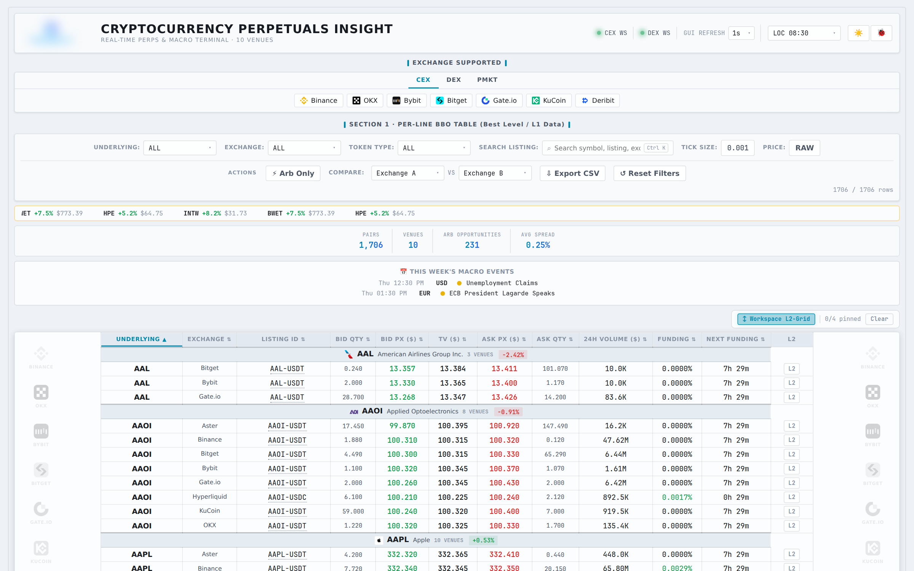
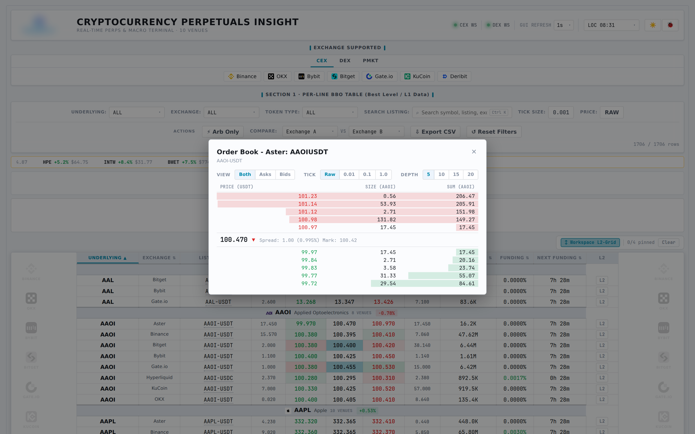

# Perpetuals Insight Dashboard

Shared dashboard for the desk that streams top of book and order book depth for tokenized-equity perpetuals on 10 venues, so prices, spreads and funding can be compared on one screen.

Everything on screen is public market data.

## Features

- About 1,700 listings across Binance, OKX, Bybit, Bitget, Gate.io, KuCoin, Deribit, Hyperliquid, Aster and Polymarket Perps
- Best bid/offer table grouped by underlying, with sizes, 24h volume, funding rate and time to next funding
- Cross-venue arbitrage highlighting, an arb-only filter and an exchange vs exchange comparison
- Order book for each listing, 5 to 20 levels, with tick aggregation
- Price movers ticker, weekly macro calendar, CSV export, light and dark themes

## Stack

One asyncio WebSocket connector per venue. Each one normalises data into a common schema kept in an in-memory store, and FastAPI pushes updates to the browser. A scheduled job picks up new listings, and a cron watchdog restarts the app if it goes down.

## Fixing a feed crash

During an audit I found that one malformed symbol could take down a venue's whole WebSocket feed. I changed the symbol handling so a bad symbol only drops itself, then re-checked L1 and L2 data on all 10 venues.

Code is proprietary. More of my work: [work-portfolio](https://github.com/mjaun556-svg/work-portfolio)
